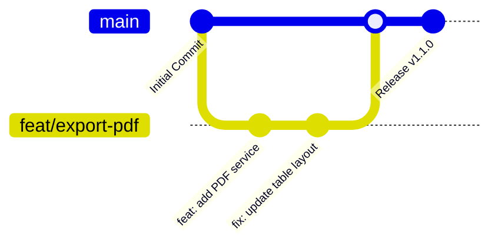

# Panduan Pengembangan & Penambahan Fitur (Git Workflow Guide)

Dokumen ini berisi standar operasional dan panduan lengkap untuk penambahan fitur baru (*feature development*), penamaan branch, konvensi commit, hingga proses integrasi kode (*Pull Request*) pada proyek **SISIP Program**.

---

## 📌 Daftar Isi
1. [Standar Penamaan Branch](#-1-standar-penamaan-branch-branch-naming-conventions)
2. [Alur Kerja Git (Git Workflow)](#-2-alur-kerja-git-git-workflow)
3. [Konvensi Pesan Commit (Conventional Commits)](#-3-konvensi-pesan-commit-conventional-commits)
4. [Panduan Teknis Penambahan Fitur](#-4-panduan-teknis-penambahan-fitur)
   - [A. Fitur Backend (Flask API)](#a-fitur-backend-flask-api)
   - [B. Fitur Frontend (React + Vite)](#b-fitur-frontend-react--vite)
   - [C. Modul Machine Learning / Data Processing](#c-modul-machine-learning--data-processing)
5. [Pengujian & Verifikasi Lokal](#-5-pengujian--verifikasi-lokal)
6. [Aturan Keamanan Data & Berkas Sensitif](#-6-aturan-keamanan-data--berkas-sensitif)
7. [Checklist Pull Request (PR)](#-7-checklist-pull-request-pr)

---

## 🏷️ 1. Standar Penamaan Branch (Branch Naming Conventions)

Setiap penambahan fitur, perbaikan bug, atau tugas pengembangan harus dilakukan pada **branch terpisah** yang dibuat dari branch utama (`main`). 

Gunakan format penamaan berikut:
`<prefix>/<nama-singkat-fitur-atau-tugas>`

### Prefiks Branch yang Valid:

| Prefiks | Peruntukan | Contoh Nama Branch |
| :--- | :--- | :--- |
| `feat/` atau `feature/` | Fitur baru atau fungsionalitas baru | `feat/export-pdf-rekap` atau `feature/auth-jwt` |
| `fix/` atau `bugfix/` | Perbaikan kesalahan (*bug*) pada kode | `fix/chart-overflow-mobile` atau `bugfix/excel-parser-null` |
| `refactor/` | Pengorganisasian ulang kode tanpa mengubah perilaku fitur | `refactor/cnn-pipeline` atau `refactor/db-connection-pool` |
| `docs/` | Perubahan atau penambahan dokumentasi | `docs/update-readme` atau `docs/server-guide` |
| `style/` | Penyesuaian tampilan/UI/CSS tanpa merubah logika bisnis | `style/dark-mode-table` |
| `hotfix/` | Perbaikan darurat pada lingkungan produksi | `hotfix/db-connection-leak` |
| `test/` | Penambahan atau perbaikan unit test / integrasi | `test/api-prediction-endpoints` |

### ⚠️ Aturan Penting Penamaan Branch:
- Gunakan **huruf kecil (*lowercase*)** sepenuhnya.
- Gunakan tanda hubung `-` (*kebab-case*) sebagai pemisah kata (bukan spasi atau *underscore* `_`).
- Hindari nama branch yang terlalu umum seperti `test`, `fitur-baru`, atau `update`.
- Buat nama branch singkat namun jelas menggambarkan tugas yang dikerjakan.

---

## 🔄 2. Alur Kerja Git (Git Workflow)

Pengembangan menggunakan pendekatan **Feature Branch Workflow**:



### Langkah-langkah Alur Kerja:

#### 1. Sinkronisasi Branch Utama (`main`)
Sebelum mulai membuat branch baru, pastikan branch `main` lokal Anda sudah mendapatkan pembaruan terbaru dari server remote:
```bash
git checkout main
git pull origin main
```

#### 2. Buat Branch Baru
Buat dan berpindahlah ke branch baru sesuai fitur yang akan dikembangkan:
```bash
git checkout -b feat/nama-fitur-baru
```

#### 3. Lakukan Pengembangan Kode
Kerjakan fitur pada lingkungan lokal (Backend / Frontend / ML Model).

#### 4. Cek Status dan Stage Perubahan
Periksa berkas mana saja yang telah diubah:
```bash
git status
```
Tambahkan berkas ke *staging area*:
```bash
# Untuk menambahkan berkas tertentu:
git add backend/app.py frontend/src/components/NewFeature.jsx

# Atau untuk staging seluruh perubahan:
git add .
```

#### 5. Buat Commit Kode
Tuliskan pesan commit sesuai standar [Conventional Commits](#-3-konvensi-pesan-commit-conventional-commits):
```bash
git commit -m "feat(backend): tambah REST API endpoint export pdf"
```

#### 6. Push Branch ke Remote Repositori
Kirim branch fitur Anda ke repositori GitHub:
```bash
git push -u origin feat/nama-fitur-baru
```

#### 7. Buat Pull Request (PR)
Buka repositori pada browser dan buat **Pull Request (PR)** dari branch `feat/nama-fitur-baru` menuju branch `main`.

#### 8. Merge & Hapus Branch
Setelah PR ditinjau dan disetujui, merge kode ke branch `main`. Setelah itu, hapus branch fitur yang sudah selesai:
```bash
# Hapus branch lokal:
git checkout main
git pull origin main
git branch -d feat/nama-fitur-baru

# Hapus branch remote (opsional jika belum terhapus otomatis di GitHub):
git push origin --delete feat/nama-fitur-baru
```

---

## 📝 3. Konvensi Pesan Commit (Conventional Commits)

Format pesan commit yang terstruktur mempermudah pelacakan histori proyek. Format standar yang digunakan adalah:

```text
<type>(<scope>): <deskripsi singkat perubahan>
```

### Tipe Commit (*Types*):
- **`feat`**: Penambahan fitur baru.
- **`fix`**: Perbaikan kesalahan (*bug*).
- **`refactor`**: Perubahan struktur kode tanpa mengubah fungsi (refactoring).
- **`docs`**: Perubahan pada berkas dokumentasi (`README.md`, `PANDUAN_SERVER.md`, dll.).
- **`style`**: Penyesuaian format, spasi, CSS, atau tata letak UI tanpa mengubah logika.
- **`perf`**: Perubahan kode untuk meningkatkan performa/kecepatan.
- **`test`**: Penambahan atau pengujian unit test.
- **`chore`**: Tugas rutin build, manajemen dependensi paket (`package.json`, `requirements.txt`).

### Scope (Opsional):
Lingkup modul yang diubah, contoh: `backend`, `frontend`, `model`, `db`, `ui`.

### Contoh Pesan Commit yang Baik:
```bash
git commit -m "feat(backend): tambah endpoint /api/predict-batch-async"
git commit -m "fix(frontend): perbaiki bug render modal detail mahasiswa pada mobile view"
git commit -m "refactor(model): optimasi preprocessing data tabular 2D CNN"
git commit -m "docs(readme): perbarui panduan penambahan fitur dan struktur direktori"
git commit -m "style(ui): perbarui skema warna badge status risiko mahasiswa"
```

---

## 🛠️ 4. Panduan Teknis Penambahan Fitur

### A. Fitur Backend (Flask API)
1. **Lokasi Kode**: Semua logika API berada di direktori [`backend/`](file:///media/nicho/workspace/devprojects/sisip-program/backend).
2. **Penambahan Endpoint**:
   - Daftarkan route baru di [`backend/app.py`](file:///media/nicho/workspace/devprojects/sisip-program/backend/app.py).
   - Pastikan return response konsisten dalam format JSON:
     ```json
     {
       "status": "success",
       "message": "Deskripsi singkat hasil",
       "data": { ... }
     }
     ```
   - Gunakan status code HTTP yang sesuai (`200 OK`, `201 Created`, `400 Bad Request`, `500 Internal Server Error`).
3. **Dependensi Baru**: Jika menambahkan modul Python baru, perbarui file `requirements.txt`:
   ```bash
   pip freeze > requirements.txt
   ```

### B. Fitur Frontend (React + Vite)
1. **Lokasi Kode**: Semua komponen & modul frontend berada di direktori [`frontend/src/`](file:///media/nicho/workspace/devprojects/sisip-program/frontend/src).
2. **Struktur Komponen**:
   - Komponen re-usable letakkan di `frontend/src/components/`.
   - Halaman utama letakkan di `frontend/src/pages/` atau `views/`.
3. **Pemasangan API Client**:
   - Gunakan Axios atau Fetch API untuk komunikasi dengan Backend Flask.
   - Manfaatkan konfigurasi proxy Vite pada [`frontend/vite.config.js`](file:///media/nicho/workspace/devprojects/sisip-program/frontend/vite.config.js) agar panggilan API tidak mengalami masalah CORS pada lingkungan pengembangan lokal.
4. **Styling & Icons**:
   - Gunakan skema utilitas **Tailwind CSS v4** untuk menjaga konsistensi visual.
   - Gunakan **Lucide React Icons** untuk kebutuhan ikonografi.

### C. Modul Machine Learning / Data Processing
1. **Eksperimen Model**:
   - Modul eksperimen atau training model letakkan di akar repositori (misal: [`cnn_tabular_2d_v2.py`](file:///media/nicho/workspace/devprojects/sisip-program/cnn_tabular_2d_v2.py)) atau dalam sub-folder dedicated jika diperlukan.
2. **Artifact Model**:
   - Simpan weights/checkpoint model (`*.keras`, `*.h5`, `*.pkl`) di lokasi yang aman. **Jangan commit file biner checkpoint besar ke Git** jika melampaui batas kuota atau berisi data sensitif.

---

## 🧪 5. Pengujian & Verifikasi Lokal

Sebelum melakukan push dan membuka Pull Request, pastikan untuk memverifikasi fitur secara lokal:

1. **Jalankan Backend Flask**:
   ```bash
   cd backend
   python app.py
   ```
   Pastikan tidak ada error sintaks atau kegagalan koneksi SQLite.

2. **Jalankan Frontend React**:
   ```bash
   cd frontend
   npm run dev
   ```
   Pastikan aplikasi dapat dibuka di browser (`http://localhost:5173`) dan komponen baru merender tanpa error di konsol.

3. **Verifikasi Build Production (Frontend)**:
   ```bash
   cd frontend
   npm run build
   ```
   Pastikan proses bundling tidak mengalami kegagalan (*zero build errors*).

---

## 🔒 6. Aturan Keamanan Data & Berkas Sensitif

Demi menjaga kerahasiaan data pribadi mahasiswa dan keamanan server:

> [!CAUTION]
> **DILARANG COMMIT DATA MAHASISWA & PRIVASI:**
> - File rekapitulasi nilai Excel (`DATA MAHASISWA *.xlsx`, `*.csv`) **TIDAK BOLEH** di-commit ke Git.
> - File database SQLite lokal ([`sisip_database.db`](file:///media/nicho/workspace/devprojects/sisip-program/backend/sisip_database.db)) **DIABAIKAN** secara otomatis oleh `.gitignore`.
> - Kredensial rahasia (API Keys, Secret Keys, Password) harus ditempatkan pada berkas `.env` (bukan di-commit langsung ke dalam kode).

---

## ✅ 7. Checklist Pull Request (PR)

Sebelum mengajukan PR ke branch `main`, centang seluruh poin berikut:

- [ ] Branch telah mengikuti format penamaan (misal: `feat/nama-fitur`).
- [ ] Fitur telah dites secara manual pada lingkungan lokal backend & frontend.
- [ ] Pesan commit mengikuti format Conventional Commits.
- [ ] `npm run build` pada frontend berjalan lancar tanpa *error*.
- [ ] Tidak ada berkas data sensitif (`.xlsx`, `.csv`, `.db`) atau `.env` yang terseret ke dalam staging Git.
- [ ] Dokumentasi diperbarui jika terdapat perubahan pada endpoint REST API atau alur sistem.

---
*Jika ada pertanyaan mengenai alur kerja ini, hubungi tim pengembang proyek SISIP Program.*
